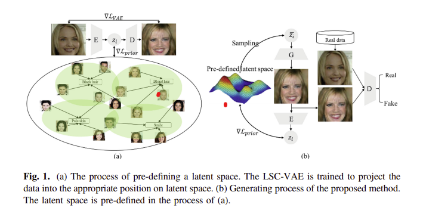
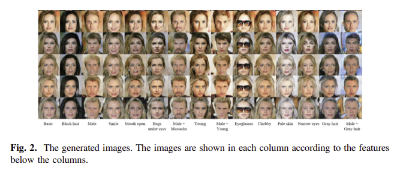

## Conditioned Generative Model via Latent Semantic Controlling for Learning Deep Representation of Data

## LSC GAN
<p align="center">
  
</p>


### Proposed Method
- Training the LSC-VAE with $\mathcal{L}_{prior}$ for the data to be projected into the desired position on the latent space according to the characteristics of the data.
- G and discriminator (D) are trained simulatneously so that G can produce data similar to real data as much as possible and that D can distinguish the real from the fake.


### Initializing the Latent Space with LSC-VAE 
- $`\mathbb{i}`$ be a feature which is included in data x and latent space $`\mathbb{z}`$
- In General, $\mathbb{z} \sim \mathcal{N}(0,I)$, but we choose $\mathcal{z_i} \sim \mathcal{N}(\mu_i, I)$  for controlling latent space. 
    - if we want to produce data which has multiple features $i$ and $\mathcal{j}$, we generate data from $\mathcal{z_{ij}} \sim \mathcal{N}(\mu_i + \mu_j,I)$

* $`\mathcal{L}_{LSC-VAE} = -\mathbb{E}_{\mathcal{z_i \sim Q(z_i|x_i)}}[\log P(x_i|z_i)] + 
\mathcal{D}_{KL}[\mathcal{Q(z_i|x_i)|| P(z_i)}] = \mathcal{L}_{VAE} + \mathcal{L}_{prior}`$


### Generating Data with LSC-GAN 
- The basict training process of GAN is to adversely interact and simultaneously training ```G and D ```
    - but GAN has a critical problem, unstable proces of training. 

- The Main difference of the ```proposed model(LSC-GAN)``` with VAE-GAN and LS-GAN is that LSC-GAN is based on ```LSC-VAE for initializing a latent space``` to control it.

- To produce the desired data with $\mathbb{i}$-feature, we just input latent variable $\mathcal{z_i} \sim \mathcal{N}(\mu_i, I)$ to G

- The encoder projects the generated data back to latent space so as to be trained to minimize the difference between latent sapce where data is generated and the compressed data is projected.

- #### Loss Function 
    - $`\mathcal{min}_D\; \mathbb{E}_{x_i \sim p_{data}(x_i)}[(D(x_i) -1)^2]  + \mathbb{E}_{z_i \sim P_z(z_i)} [(D(G_{z_i}))^2]`$ 
     - $`\mathcal{min}_{Q,D} \; \mathbb{E}_{z_i \sim p_z(z_i)} [D(G(z_i) -1)^2] + \mathcal{D}_{KL}[\mathcal{Q}(z_i)|G(z_i)||\mathcal{N}(\mu_i, I)]`$


## Experiments
### Dataset and Experimental Setting
```
CelebA Dataset 
    * Crop Initial 178 x 218 size to 138 x 138 and resize them as 64 x 64
    * 162,769 Images in CelebA and 14 attributes 
        * (black hair), (blond hair), (gary hair), (male), (female), (smile), (mouth slightly open), (young), (narrow eyes), (bags under eyes), (mustache), (eyeglasses), (pale skin), ( chubby)
```

- LSC-VAE takes facial images as input and constructs a latent space.
- Next, the LSC-GAN exploits the LSC-VAE, resulting in the stabilized training process and the well-defined latent space.
- We ```assign 20 dimensions to each feature``` and set mean of the $\mathbb{i}^{th}-20$ dimensions as 1 for enough capacity ```to represent each characteristics of data. ```

    - For example, if an image has $\mathcal{i}$-feature, the elements of $\mathbb{i} \ast 20^{th}$ to $(i+1) \ast 20^{th}$ of image's latent variable are 1 in average and 0 in the remainder.
    - we denote the latent variable as $n_i$.


### Generated Images
<p align="center">
  
</p>

- $ x_{ij} = G(z_i + n_j)$, where $x_{ij}$ is an image which has $i$- and $j$-features, and $z_i$ is the latent variable.
